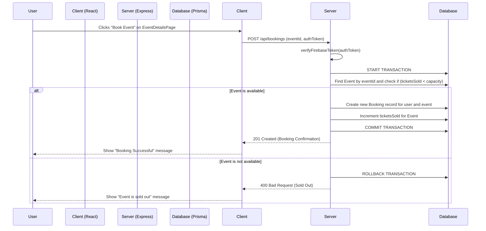

# Software Engineering Project Report: Evently

This document provides a detailed analysis of the Evently application, covering its design, development, and management based on established software engineering principles.

## 1. Problem Statement and Process Model

### 1.1. Problem Statement

Evently is a comprehensive, full-stack web application designed to serve as a centralized platform for event management. The project addresses the distinct needs of three user groups:
*   **General Users:** Require a user-friendly interface to discover, search, and book a variety of events. They need to manage their bookings and receive confirmations.
*   **Event Organizers:** Need a suite of tools to create, manage, and promote their events. This includes submitting events for approval, tracking ticket sales, and viewing analytics for their events.
*   **Administrators:** Require a powerful dashboard to oversee the entire platform. Their responsibilities include managing user roles, approving or rejecting events submitted by organizers, and monitoring the overall health and performance of the application through analytics.

Evently aims to bridge the gap between these groups by providing a seamless, role-based experience that is both intuitive and efficient.

### 1.2. Process Model: Agile (Scrum)

The development process for Evently is best described by the **Agile (Scrum)** model. This is strongly suggested by the iterative nature of the database migrations found in `server/prisma/migrations/`. The migration history shows a clear, incremental addition of features, which is a hallmark of an Agile approach.

*   **Evidence of Iteration:**
    *   The initial migration (`20251001161138_init`) establishes the basic `User`, `Event`, and `Booking` tables.
    *   Subsequent migrations add specific features in what appear to be separate development cycles:
        *   `20251001164828_implement_features`: Adds `Waitlist`, `capacity`, and `tags`.
        *   `20251002120600_add_user_roles`: Introduces the `role` field for users.
        *   `20251002131254_add_organizer_workflow` & subsequent migrations: Build out the entire organizer and event approval workflow.
        *   `20251003090606_add_hype_feature`: Adds the "hype" (like) functionality.
        *   `20251003103940_add_watchlist`: Adds the watchlist feature.

This iterative development allows for flexibility, continuous feedback, and the ability to adapt to changing requirements, making it an ideal choice for a project like Evently.

---

## 2. Requirement Analysis

### 2.1. Software Requirement Specification (SRS)

#### 2.1.1. Introduction
*   **Purpose:** This document specifies the functional and non-functional requirements for the Evently web application.
*   **Scope:** The system will provide a multi-user platform for event discovery, booking, management, and administration, featuring role-based access control.
*   **Actors:** General User, Organizer, Administrator.

#### 2.1.2. Overall Description
*   **Product Perspective:** A self-contained, monolithic repository containing a client-server web application. The client is a React Single-Page Application (SPA), and the server is a Node.js/Express backend API.
*   **User Classes and Characteristics:**
    *   **General Users:** Can search for events, view event details, book tickets, view their bookings, and request to become an organizer.
    *   **Organizers:** Can create, edit, and manage their own events. They can view analytics for their events, such as ticket sales.
    *   **Administrators:** Have full superuser control over the platform. They can manage all users and their roles, approve or reject events submitted by organizers, and view platform-wide analytics.
*   **Operating Environment:** The application is designed to run on modern web browsers. The server-side environment is Node.js with a SQLite database, which is suitable for development but would require a more robust database for production.

#### 2.1.3. System Features (Functional Requirements)
*   **FR1: User Authentication:**
    *   Users can sign up and log in using email/password or Google OAuth (as seen in `client/src/pages/AuthPage.jsx`).
    *   The system uses Firebase for authentication.
*   **FR2: Event Discovery:**
    *   Users can search for events by keywords.
    *   The home page displays carousels of upcoming, trending, and best-selling events.
*   **FR3: Event Booking:**
    *   Authenticated users can book tickets for an event.
    *   The system checks for ticket availability before confirming a booking.
    *   If an event is sold out, users can join a waitlist.
*   **FR4: Event Management (Organizer):**
    *   Organizers can create new events, which are initially in a `DRAFT` state.
    *   Events can be submitted for approval, moving them to a `PENDING_APPROVAL` state.
    *   Organizers can view the status of their submitted events.
*   **FR5: Administration:**
    *   Admins have a dedicated dashboard to view platform statistics.
    *   Admins can view and manage all users, including changing their roles.
    *   Admins can approve or reject pending events.
    *   Admins can view and approve or reject requests from users to become organizers.

#### 2.1.4. Non-Functional Requirements
*   **NFR1: Performance:** The application should be responsive, with key pages and data loading within a reasonable timeframe (e.g., under 3 seconds). The use of skeleton loaders (`client/src/components/skeletons/`) indicates an awareness of perceived performance.
*   **NFR2: Security:**
    *   All communication between the client and server must be over HTTPS in a production environment.
    *   Authentication is handled by Firebase, a secure, third-party service.
    *   Authorization is strictly role-based, with middleware (`isAdmin`, `isOrganizer` in `server/src/server.js`) protecting sensitive endpoints.
*   **NFR3: Usability:** The user interface should be intuitive and easy to navigate. The application is designed to be responsive, with a mobile-first navigation approach (as seen in `client/src/components/Footer/index.jsx`).
*   **NFR4: Scalability:** The backend is designed to be stateless, which allows for horizontal scaling of the server. However, the use of a single-file SQLite database is a significant bottleneck for scalability and would need to be replaced with a production-grade database (e.g., PostgreSQL, MySQL) in a real-world scenario.

### 2.2. Use Cases

| Actor     | Use Case                               | Description                                                                 |
| :-------- | :------------------------------------- | :-------------------------------------------------------------------------- |
| **User**  | Search for Events                      | The user enters a search query in the search bar. The system returns a list of events matching the query. |
|           | View Event Details                     | The user clicks on an event card. The system displays a detailed page with information about the event, including date, time, location, description, and price. |
|           | Book an Event                          | On the event details page, the user clicks the "Book Now" button. The system verifies ticket availability and creates a booking record. The user receives a confirmation. |
|           | View My Bookings                       | The user navigates to the "My Bookings" page. The system displays a list of all events the user has booked. |
|           | Request Organizer Role                 | The user navigates to their profile and submits a request to become an organizer, providing an organization name. The system records the request for admin review. |
| **Organizer** | Create Event                         | The organizer fills out a form with event details (name, date, description, etc.) and submits it. The event is saved in a `DRAFT` state. |
|           | Submit Event for Approval              | The organizer submits a draft event for approval. The event's status changes to `PENDING_APPROVAL`. |
|           | View Event Analytics                   | The organizer navigates to their dashboard to view statistics for their published events, such as the number of tickets sold. |
| **Admin** | Approve/Reject Event                   | The admin reviews a list of pending events. They can choose to approve or reject each event. Approved events become `PUBLISHED`, while rejected events are marked as `REJECTED`. |
|           | Manage User Roles                      | The admin views a list of all users and can change their roles between `USER`, `ORGANIZER`, and `ADMIN`. |

### 2.3. Data Flow Diagram (DFD) - Textual Representation

#### Level 0 DFD
```
(External Entity: User) ---[Event Booking Request]---> (Process 0: Evently System)
(Process 0: Evently System) ---[Booking Confirmation]---> (External Entity: User)

(External Entity: Organizer) ---[New Event Data]---> (Process 0: Evently System)
(Process 0: Evently System) ---[Event Status]---> (External Entity: Organizer)

(External Entity: Admin) ---[Approval Decision]---> (Process 0: Evently System)
(Process 0: Evently System) ---[Platform Reports]---> (External Entity: Admin)
```

### 2.4. Sequence Diagram - "Book an Event"



### 2.5. Data Dictionary (Based on `prisma/schema.prisma`)

| Table             | Field               | Type      | Description                                      |
| :---------------- | :------------------ | :-------- | :----------------------------------------------- |
| **User**          | `id`                | String    | Unique identifier for the user.                  |
|                   | `firebaseUid`       | String    | The unique ID provided by Firebase Authentication. |
|                   | `email`             | String    | The user's email address.                        |
|                   | `organizationName`  | String?   | The name of the organization the user belongs to, if any. |
|                   | `createdAt`         | DateTime  | The timestamp when the user was created.         |
|                   | `role`              | Enum      | The user's role (`USER`, `ORGANIZER`, `ADMIN`).  |
| **Event**         | `id`                | Int       | Auto-incrementing primary key.                   |
|                   | `name`              | String    | The title of the event.                          |
|                   | `date`              | DateTime  | The date and time of the event.                  |
|                   | `location`          | String    | The location of the event.                       |
|                   | `price`             | Float     | The price of a ticket for the event.             |
|                   | `description`       | String    | A detailed description of the event.               |
|                   | `organizerName`     | String    | The name of the organizer of the event.          |
|                   | `imageUrl`          | String?   | A URL for the event's image.                     |
|                   | `isFeatured`        | Boolean   | Whether the event is featured on the home page.  |
|                   | `tags`              | String    | Comma-separated tags for categorizing the event. |
|                   | `capacity`          | Int       | The maximum number of tickets available.         |
|                   | `ticketsSold`       | Int       | The number of tickets sold.                      |
|                   | `hypeCount`         | Int       | The number of users who have "hyped" the event.  |
|                   | `status`            | Enum      | The approval status of the event (`DRAFT`, `PENDING_APPROVAL`, `PUBLISHED`, `REJECTED`, `CANCELED`). |
|                   | `organizerId`       | String?   | A foreign key linking to the `User` who created the event. |
| **Booking**       | `id`                | Int       | Auto-incrementing primary key.                   |
|                   | `userId`            | String    | A foreign key linking to the `User` who booked the event. |
|                   | `eventId`           | Int       | A foreign key linking to the `Event` that was booked. |
| **OrganizerRequest** | `id`             | String    | Unique identifier for the request.               |
|                   | `status`            | Enum      | The status of the request (`PENDING`, `APPROVED`, `REJECTED`). |
|                   | `requestedOrgName`  | String    | The name of the organization the user wants to create. |
|                   | `userId`            | String    | A foreign key linking to the `User` who made the request. |

---

## 3. Project Management

### 3.1. Timeline Chart (Gantt)

| Phase                 | Task                           | Duration (Weeks) |
| :-------------------- | :----------------------------- | :--------------- |
| **1. Initiation**     | Requirement Gathering & Analysis | 1                |
|                       | Project Setup & Scaffolding    | 1                |
| **2. Design**         | Architectural Design           | 1                |
|                       | Database Schema Design         | 1                |
| **3. Development**    | **Sprint 1:** User Auth & Roles  | 2                |
|                       | **Sprint 2:** Event CRUD & Discovery | 2                |
|                       | **Sprint 3:** Booking & Payments | 2                |
|                       | **Sprint 4:** Admin Dashboard    | 2                |
|                       | **Sprint 5:** Organizer Workflow | 2                |
| **4. Testing**        | Integration & System Testing   | 2                |
| **5. Deployment**     | Deployment & Release           | 1                |
| **Total**             |                                | **15 Weeks**     |

### 3.2. FP, Effort, and Cost Estimation

#### Function Point (FP) Calculation
*   **External Inputs (EI):** 5 (User Signup, Event Creation, Booking, Organizer Request, Admin Approval)
*   **External Outputs (EO):** 4 (Booking Confirmation, Event List, Admin Reports, Organizer Analytics)
*   **External Inquiries (EQ):** 3 (Search Events, View Event Details, View My Bookings)
*   **Internal Logical Files (ILF):** 5 (User, Event, Booking, OrganizerRequest, UserHype)
*   **External Interface Files (EIF):** 1 (Firebase Auth)

Assuming 'average' complexity for all, the Unadjusted Function Points (UFP) is **~55-65**.
With a Value Adjustment Factor (VAF) of 1.10 (for a distributed system), the final **FP is ~66**.

#### Effort Estimation
Using a simple model where 1 FP = 10 person-hours:
*   **Effort** = 66 FP * 10 hours/FP = **660 Person-Hours**.
*   Assuming a team of 3 developers, this is roughly **220 hours per developer**.

#### Cost Estimation
*   Assuming an average loaded cost of $50/hour:
*   **Total Cost** = 660 hours * $50/hour = **$33,000**.

### 3.3. Risk Table

| Risk ID | Description                               | Probability | Impact | Mitigation Strategy                                                                                             |
| :------ | :---------------------------------------- | :---------- | :----- | :-------------------------------------------------------------------------------------------------------------- |
| **R01** | **Technical Debt**                        | Medium      | High   | Implement a strict code review process. Schedule regular refactoring sprints. Use a linter and code formatter.    |
| **R02** | **Security Vulnerability**                | Low         | High   | Use established libraries (Firebase, Prisma). Perform regular security audits. Sanitize all user inputs.        |
| **R03** | **Scalability Bottleneck**                | High        | Medium | Plan for migration from SQLite to a production-grade database like PostgreSQL or MySQL before public launch.    |
| **R04** | **Scope Creep**                           | Medium      | Medium | Adhere strictly to the Agile backlog. The Product Owner must approve any changes to scope.                      |
| **R05** | **Low User Adoption**                     | Medium      | High   | Conduct user experience (UX) research early. Implement a marketing plan for launch.                             |
| **R06** | **Firebase Vendor Lock-in**               | Low         | Medium | Abstract authentication logic behind a custom hook (`useAuth`) to make it easier to swap out the auth provider if needed. |

---

## 4. Design Engineering

### 4.1. Architectural Design

Evently uses a **Three-Tier Client-Server Architecture**.

1.  **Presentation Tier (Client):** A React Single-Page Application (SPA) built with Create React App. It handles the UI, client-side routing (`react-router-dom`), and state management (`zustand`). It communicates with the backend via RESTful API calls.
2.  **Logic Tier (Server):** A Node.js/Express application that serves as the API backend. It contains all the business logic, handles user authentication and authorization (with `firebase-admin`), and processes data.
3.  **Data Tier (Database):** A SQLite database managed by the Prisma ORM. It is responsible for data persistence and integrity.

This is a classic, robust architecture for modern web applications, separating concerns and allowing the frontend and backend to be developed and scaled independently.

### 4.2. Pseudocode of a Small Module

**Module:** `verifyFirebaseToken` middleware (from `server/src/server.js`)

```
FUNCTION verifyFirebaseToken(request, response, next):
  // Get the token from the 'Authorization' header
  authHeader = request.headers['authorization']

  // Check if the header exists and is correctly formatted
  IF authHeader is null or not starts with "Bearer " THEN
    RETURN response.status(401).send("Unauthorized: No token provided")
  END IF

  // Extract the token from the header
  token = authHeader.split(' ')[1]

  TRY
    // Use Firebase Admin SDK to verify the token
    decodedToken = firebaseAdmin.auth().verifyIdToken(token)

    // Attach the user's UID to the request object for later use
    request.firebaseUid = decodedToken.uid

    // Pass control to the next middleware or route handler
    CALL next()
  CATCH error
    // If verification fails, the token is invalid
    RETURN response.status(401).send("Forbidden: Invalid token")
  END TRY
END FUNCTION
```

---

## 5. Coding

The application is divided into two main modules:

*   **`client` module:** A React application responsible for the user interface. It is built using modern JavaScript (ES6+), JSX, and CSS modules. Key libraries include `react`, `react-router-dom` for routing, `zustand` for state management, and `firebase` for client-side authentication.
*   **`server` module:** A Node.js/Express application that provides the backend API. It uses ES modules (`"type": "module"` in `package.json`). It interacts with a SQLite database via the Prisma ORM. Key libraries include `express` for the web server, `@prisma/client` for database access, and `firebase-admin` for backend authentication.

The code is well-structured, with a clear separation of concerns between the client and server, and within each module, a logical organization of files by feature (e.g., components, pages, stores).

---

## 6. Testing

### 6.1. Basis Path Set for a Module

**Module:** `verifyFirebaseToken` middleware (from `server/src/server.js`)

#### Control Flow Graph (Textual Representation)
```
1. START
2. Get authHeader from request.headers
3. IF authHeader is null or not starts with "Bearer "?
   /   \
 (T)   (F)
  |     |
  4.    5. Extract token from authHeader
  |     |
  11.   6. TRY to verify token
        |
        7. CATCH error?
           /   \
         (T)   (F)
          |     |
          8.    9. Attach firebaseUid to request
          |     |
          11.   10. CALL next()
                |
                11.
                 |
                 12. END
```
*   **Predicate Nodes (P):** 2 (`IF authHeader is null?`, `CATCH error?`).
*   **Cyclomatic Complexity (V(G))**: P + 1 = 2 + 1 = **3**.

#### Basis Path Set
1.  **Path 1 (Happy Path):** 1 -> 2 -> 3(F) -> 5 -> 6 -> 7(F) -> 9 -> 10 -> 12
2.  **Path 2 (No/Invalid Header):** 1 -> 2 -> 3(T) -> 4 -> 12
3.  **Path 3 (Invalid Token):** 1 -> 2 -> 3(F) -> 5 -> 6 -> 7(T) -> 8 -> 12

### 6.2. Test Cases

| Test Case ID | Path | Inputs                               | Expected Output                               |
| :----------- | :--- | :----------------------------------- | :-------------------------------------------- |
| **TC-01**    | 1    | `Authorization` header with a valid "Bearer " token. | `next()` is called, `req.firebaseUid` is populated. |
| **TC-02**    | 2    | No `Authorization` header.          | HTTP 401 Unauthorized response.               |
| **TC-03**    | 2    | `Authorization` header with a non-Bearer token. | HTTP 401 Unauthorized response.               |
| **TC-04**    | 3    | `Authorization` header with an invalid/expired Bearer token. | HTTP 401 Unauthorized response.                  |